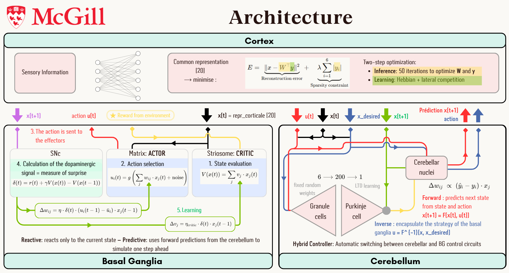

# Doya (1999, 2000) — Modular Brain Architecture: an Implementation

Term paper for **NEUR503 (McGill University)** — Nicolas Weill.

This project implements Kenji Doya's view of the brain as three specialised learning systems, and tests it on control tasks (CartPole, Super Mario Bros):

| Brain structure | Learning paradigm | Implementation |
|---|---|---|
| **Cerebral cortex** | Unsupervised (sparse coding, Hebbian + lateral competition) | Common low-dimensional state representation |
| **Basal ganglia** | Reinforcement learning (Actor-Critic driven by a dopamine-like TD error) | Striosome = critic, Matrix = actor, SNc = dopamine signal |
| **Cerebellum** | Supervised learning (error-driven, LTD-like) | Forward model (predicts next state) and inverse model, used in a hybrid controller |

Neuropathologies are simulated through ablations: **Parkinson's disease** (degraded basal ganglia learning) and **cerebellar ataxia** (impaired cerebellar models).

## Architecture



## Documents

- [`TermPaper_NicolasWeill.pdf`](TermPaper_NicolasWeill.pdf) — the paper
- [`Term_Paper_Appendix.pdf`](Term_Paper_Appendix.pdf) — appendix

## Repository structure

```
.
├── TermPaper_NicolasWeill.pdf
├── Term_Paper_Appendix.pdf
├── assets/architecture.png
└── TermPaper_finalcode/
    ├── cerebral_cortex*.py        # Cortex: sparse coding (base, improved, three-factor "3F")
    ├── basal_ganglia*.py          # Basal ganglia: Actor-Critic (base, eligibility-trace, Mario MLP)
    ├── cerebellum*.py             # Cerebellum: forward/inverse models, hybrid controller (base, 3F)
    ├── train_cartpole.py          # CartPole training: reactive vs predictive mode
    ├── train_cartpolev2.py        # Stabilised V2 architectures on CartPole
    ├── benchmark_cartpole.py      # Representation (cortex vs handcrafted) x strategy comparison
    ├── benchmark_final.py         # Three-factor neuromodulation comparison (2F / 3F variants)
    ├── benchmark_ablationsv2.py   # Ablations + Parkinson / ataxia simulations
    ├── *.png, *_metrics.txt       # Generated figures and metrics
    └── Mario/                     # Super Mario Bros agents
        ├── mario_doya.py          # Doya architecture (CNN cortex + BG + cerebellum), online TD(λ)
        ├── mario_ppo.py           # PPO baseline (Stable-Baselines3)
        ├── mario_brain.py         # Integrates the three modules
        └── visual_cortex_cnn.py, basal_ganglia_mario.py, cerebellum_neural.py
```

## Setup

Python 3.10+ recommended.

```bash
# CartPole experiments
pip install numpy matplotlib gymnasium

# Mario experiments (additional)
pip install torch opencv-python gym-super-mario-bros shimmy stable-baselines3[extra]
```

## Running

All commands are run from `TermPaper_finalcode/`.

### CartPole

```bash
cd TermPaper_finalcode

python train_cartpole.py                 # interactive menu
python train_cartpole.py reactive        # model-free basal ganglia
python train_cartpole.py predictive      # cerebellar forward model + planning

python benchmark_cartpole.py --episodes 1500          # representation x strategy comparison
python benchmark_final.py --episodes 1500             # 2F vs 3F neuromodulation -> report_vfinal_comparison.png
python benchmark_ablationsv2.py --episodes 800        # ablations, Parkinson & ataxia -> ablation_v2_*.png
```

Use a smaller `--episodes` (e.g. `300`) for a quick smoke test, and `--seed` to change the random seed.

### Super Mario Bros

```bash
cd TermPaper_finalcode/Mario

python mario_doya.py --train                                 # train the Doya architecture
python mario_doya.py --train --resume checkpoints_doya/best  # resume
python mario_doya.py --play checkpoints_doya/best            # watch the agent play

python mario_ppo.py --train                                  # PPO baseline
python mario_ppo.py --play checkpoints/best_model.zip
```

## Key results

Figures and metrics generated by the benchmarks are in `TermPaper_finalcode/` (`ablation_v2_*.png`, `report_vfinal_comparison.png`, `cartpole_representation_comparison.png`, `*_metrics.txt`). See the paper for the full analysis.

## References

- Doya, K. (1999). What are the computations of the cerebellum, the basal ganglia and the cerebral cortex? *Neural Networks, 12*(7–8), 961–974.
- Doya, K. (2000). Complementary roles of basal ganglia and cerebellum in learning and motor control. *Current Opinion in Neurobiology, 10*(6), 732–739.
